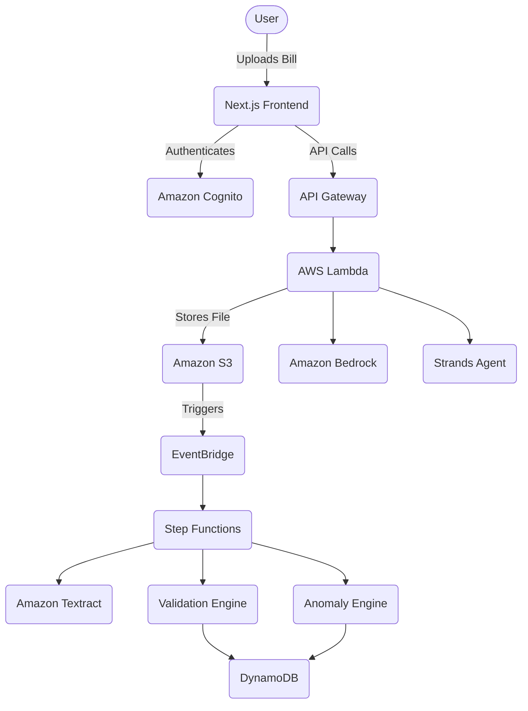

# BillShield

"Don't just read your bill. Verify it. Understand it. Question it."

## What is BillShield?
BillShield turns confusing bills into verified financial evidence—checking the math, finding unusual charges, comparing bills over time, and telling you exactly what deserves your attention.

## Problem
Financial bills are complex, inconsistent, and hard to understand. Consumers often overpay due to arithmetic errors, hidden fees, or new recurring charges they didn't notice.

## Solution
An evidence-backed financial intelligence layer that automatically validates bills, compares them against historical data, flags anomalies, and uses AI to generate clarifying questions and messages.

## Architecture


## AWS Services
- **Amazon S3**: Document storage
- **Amazon Textract**: Document extraction
- **AWS Lambda**: Backend processing
- **AWS Step Functions**: Workflow orchestration
- **Amazon DynamoDB**: Historical bill data
- **Amazon Bedrock**: Explanation and AI reasoning
- **Amazon Cognito**: Authentication
- **API Gateway**: API layer
- **CloudWatch**: Monitoring

## Features
- Upload bills
- Extract bill information deterministically
- Verify bill calculations
- Compare bills with historical bills
- Detect unusual changes / new charges
- Evidence generation
- AI investigation agent

## Local Setup
1. Clone the repository.
2. Ensure you have Node.js and Python 3.11+ installed.
3. Set `USE_MOCK_AWS=true` in `.env` to run without AWS credentials.

## Running Frontend
```bash
cd frontend
npm install
npm run dev
```

## Running Backend (Local Mock API)
```bash
cd backend
pip install -r requirements.txt
# (Instructions for local API if implemented with FastAPI will be added here)
```

## Environment Variables
Copy `.env.example` to `.env` and fill in the values.

## Demo Flow
See the prompt instructions for the detailed demo flow.

## Future Improvements
- Bill forecasting
- Search across financial history (OpenSearch)
